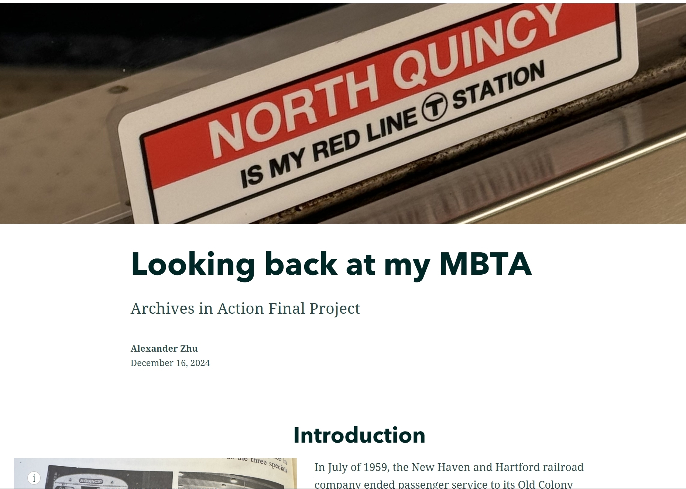
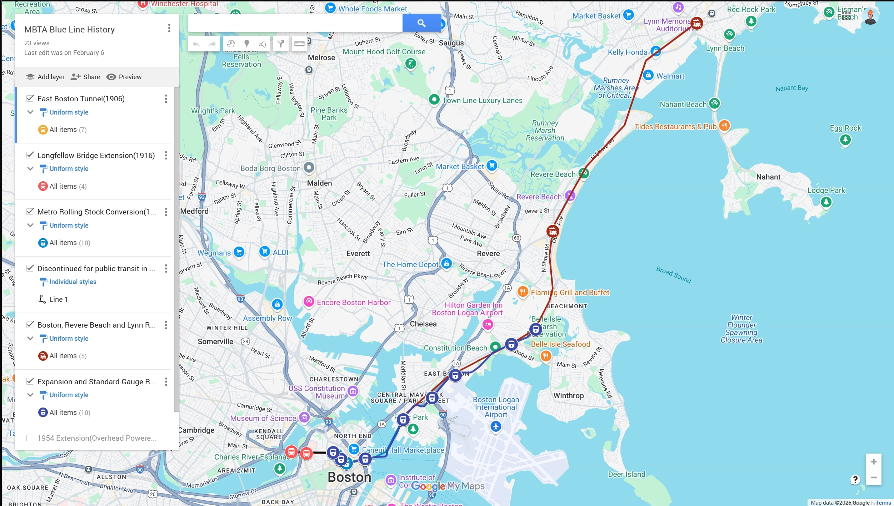
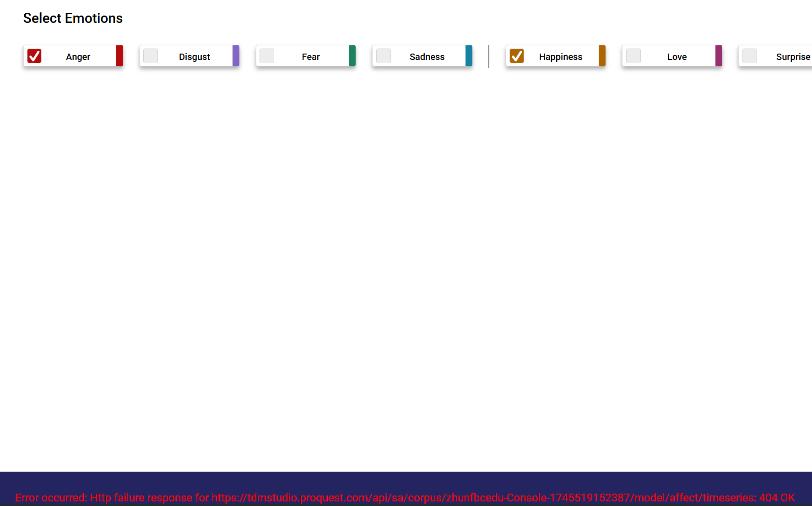
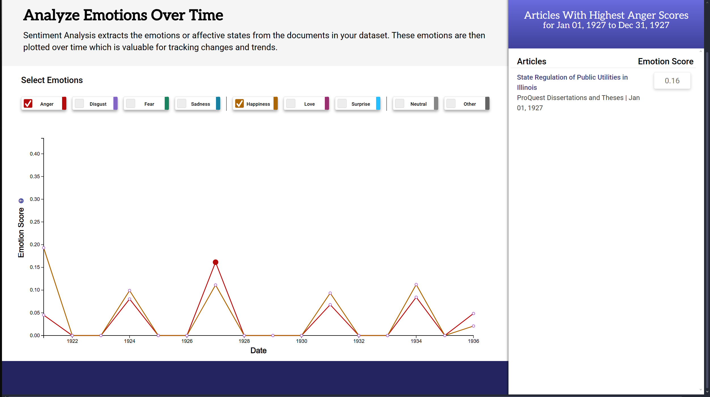

# Reflection

## Introduction

The inspiration for this project is probably the culmination of the last uear of academic work that I've done at Boston College. When I was first accepted into the English Masters program, I hoped to pursue studies in Digital Humanities and this project is the last part of this stretch of that journey. As a student who lives not on campus, the T has been a subtle, but important part of my school life. I ride it to school everyday and I've never really given it much thought. Last year, during the particular rough red line shutdowns as the new MBTA management tries to bring the T out of a state of disrepair and neglect, I began to think more about what being a rider of the T meant. This led to me creating[My MBTA](https://storymaps.arcgis.com/stories/5bdd9dba42cb458e9ac12d18d44df000) which documented the history of some of the crucial stations during my commute to Boston College.

My other class spent a few sessions on exploring how to map things. I was thinking about my other class at the time and decided to have some fun. The assignment was to use a mapping software to map something. So I chose to map the MBTA blue line since I was the least familiar. I found out a lot of fun facts such as the Blue Line cars being able to switch their power sources from third rail to overhead due to the Blue Line being a frankenstein of other previously built routes.

Those two projects set me on the path to here. I had done tidbits of my main route and a, while somewhat comprehensive, shallow look at the blue line. I wanted to do something a bit bigger and something a little more out of the present day since I was already living in it. 

---

## Research
Research proved to be rather simple. I fortunately had help from the same Burns Librarian who helped me out last semester, Marta Crilly. She was able to provide me with many archived documents including maps, route numbers, and even a lot of photos which all gave insight into how I would setup this project. Going online also helped given that there are many archives including City of Boston and Northeastern who also have documentation on MBTA History, all of which was readily available. This gave me a really strong foundation to start from when it came to doing the project.

---

## Mapping
Having already used ARCGIS for my previous MBTA related project, I was already familiar with using it to setup maps. The process was pretty smooth and refining my points became a pretty simple thing to work on while ProQuest TDM was processing datasets. One thing that became very interesting was to decide how I would handle maps disagreeing on points. There was a chance that it was due to not exact scaling on the original map making the rectified version slightly off, but it was something I considered. What really helped was the ability to reference the actual GPS map on ArcGIS as well as the books actually saying where all of the stations were. It allowed me to make the final call on where to place points in a way that was super intuitive and better than just trying to guess.

---

## Sentiment Analysis
This was admittedly the most unfamiliar part of the process for me. I had never done any work with Sentiment analysis or super specific text mining coming into the project so this was definitely the most interesting and difficult aspect of the project. Almost immediately, there were two limitations that I ran into with ProQuest. The first was that I would only be limited to 10 datasets at a time. This meant that as I created more throughout the semester, I would have to remove the older ones to make space. The second was a limitation of only having 10,000 documents per set. This wasn't a huge issue, many of my searches yielded sets that were small enough, but it is something to note.

I also had some issues come up with visualization. On many occasions, I would come to a finished data set only to be met with a 404 error and no data. I would give the dataset a few hours in case there was some additional processing, but every data set that looked like the above had to either be reran or scrapped. I am unsure of what causes this because similar or same keywords in different searches would not have this error. 

Another thing that came up were unrelated articles showing up in sentiment analysis even after restricting search parameters to include only Boston based publications. Yet, here you see an article from Illinois show up in a search with just the term "Boston Elevated Railway."

Navigating these challenges weren't the end of the world. Once I figured out how to better input keywords and set filters, a lot of these issues went away. The main issue was having to rerun searches with only being able to have 10 running at a time. The limitation plus the time it took slowed down my ability to adjust my filters and topics. Despite that, the tool was still useful in pointing me in the right direction as someone who was unfamiliar with how to do proper sentiment analysis.

---

## Conclusion and Next Steps

Something that came up a lot in my research was financials. There were many discussions of budgetary allocation and what the implications of all of it were. Given that the West End Street and Boston Elevated Railway were privately owned companies versus a publicly owned one like the MBTA, it could be interesting to do some sort of funding comparison in the future. This would show what the executive's priorities were back then versus what the people want today. This is increasingly more relevant as the MBTA continues to struggle to meet funding requirements in the Post COVID-19 world. 

Another thing I want to do is touch up some of the newer layers added within the last month. I learned about West End Street and Consolidation rather late into the process so my layers for those are in an incomplete state. It would help the map tell the story through five or six evolutions versus the three I currently have. I have toyed with the idea of bringing it all to a storymap versus just a regular online map.

The last thing would be to integrate the map with this website better. Currently, it seems to be in whatever the last state I saved the map in. I would love for it to be more interactive for the user as they currently cannot change what layers are visible or see how the original maps are laid on top of the GPS one. Whether that's something possible with ArcGIS or another software, it is on my to-do list.

In the end, I am glad that I got the chance to do this project. I don't want this to be the last of it. These last two years of being a commuter student has really made me consider more deeply the type of public transportation available to people in cities. It was really awesome to get the chance to work on this and I will continue to improve it in the future.
