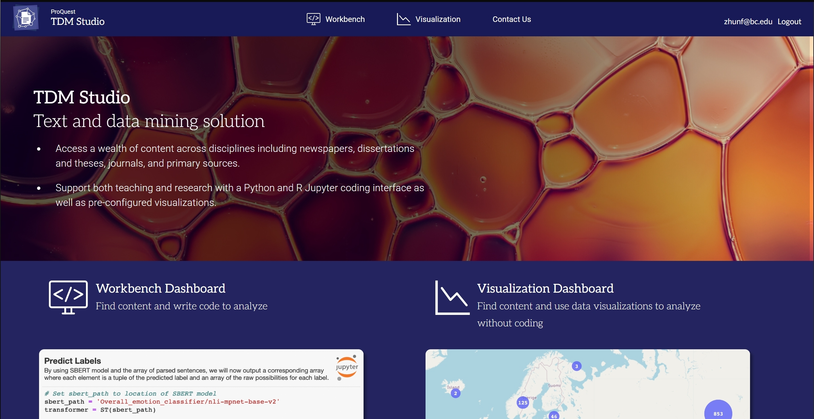
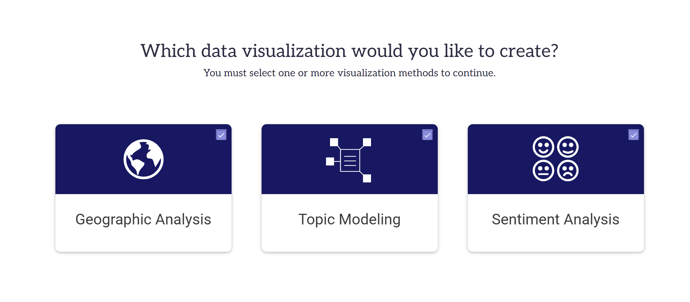
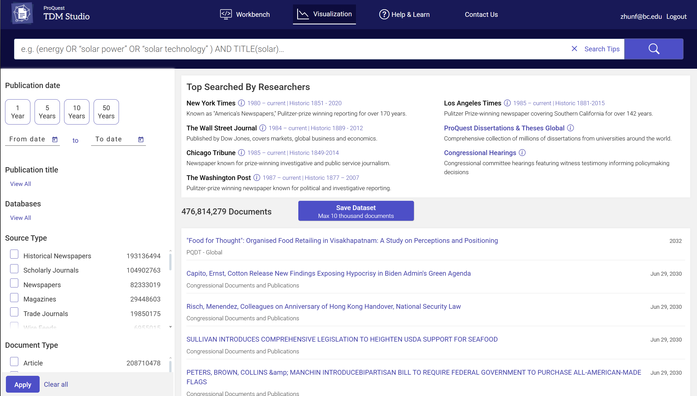
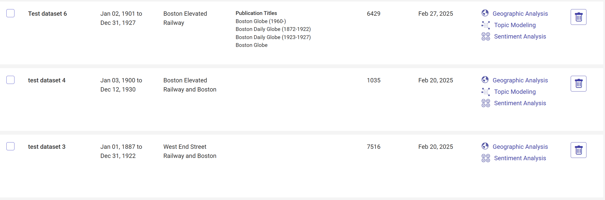
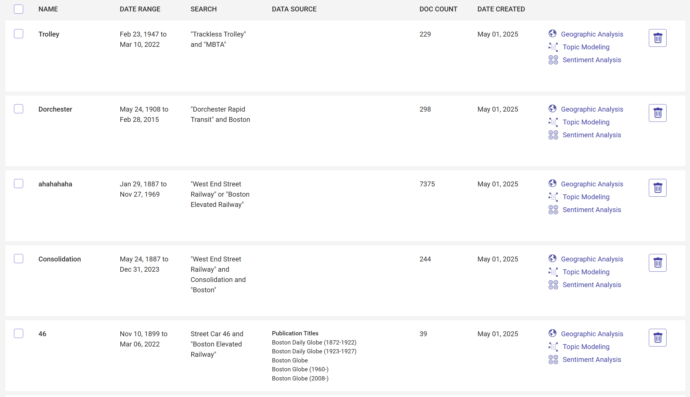
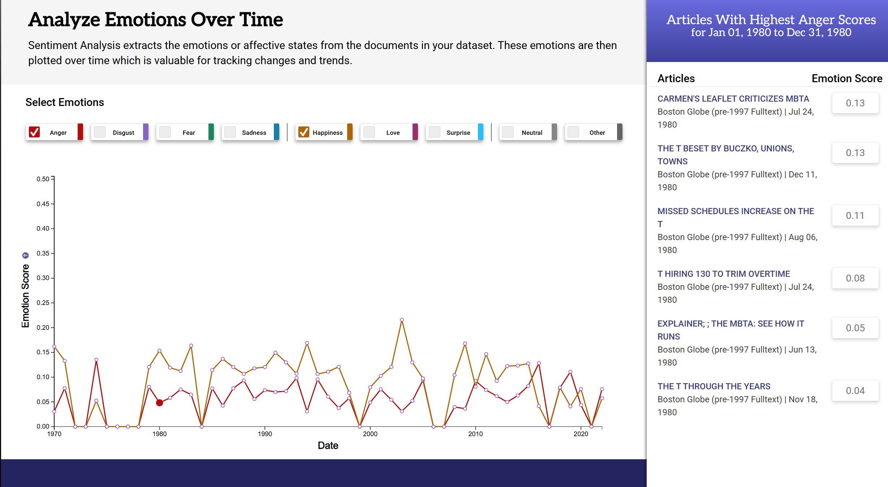

# The Tool

Early in the project, I was introduced to a variety of tools related to sentiment and textual analysis. Out of all of them, I was given a pretty comprehensive demo of ProQuest TDM, which I decided to use for this project. ProQuest TDM is a text and data mining platform that enables researchers to analyze vast amounts of content from ProQuest’s extensive database. Their database includes a variety of sources including newspapers, magazines, thesis dissertations, and many more. I mainly focused on the visualization dashboard which included three preset tools that could be automatically run on collections of up to 10,000 documents. 

|  | |
| Tools Page | Search Page |

These three tools were Topic modeling, Geographic referencing, and most importantly, Sentiment analysis. These three tools would help me develop this part of the project.

---

# The Method

## Initial Searching

Firstly, to get a general timeline of sentiment analysis. I set my search to just "Boston Elevated Railway" to get a general sense of how much refining I would need to do. Starting general was key so that I would have some base to compare with whenever I had to look into more specific topics.

As shown above, general searches yield thousands of results which gives the site a lot of data to crunch.

---

## Refining the search

